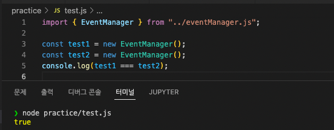

# 내 코드

```bash
npm install
node main.js
```

- EventManager 싱글톤 인스턴스 구현

```javascript
  constructor() {
    if (EventManager.instance) return EventManager.instance;
    return (EventManager.instance = this);
  }
```



- 이벤트가 발생했을 때 Subscriber 구독자를 찾기 위한 데이터 구조
  - `eventManager.dataStructure`: 일반 array로, subscriber를 추가할 때마다 `[sender, eventName, subscriber]` 를 해당 배열에 추가함.
  - `postEvent()`로 이벤트가 발행되면, for문으로 하나씩 `eventManager.dataStructure` 돌아가면서 하나하나 대조해봄...

# 나만의 체크리스트

- [ ] 이벤트 기반 동작을 도와주는 이벤트 매니저
  - [x] sharedInstance()
  - [x] add()
    - eventName "" 빈값 가능.
  - [x] remove()
  - [x] postEvent()
  - [x] stringify()
  - [ ] workerthread
- [ ] 비동기 지원
  - [ ] postEvent()
  - [ ] addSubscriber()

# 학습메모

- singleton pattern
  https://www.youtube.com/watch?v=-oy5jOd5PBg&ab_channel=%EC%BD%94%EB%93%9C%EC%97%86%EB%8A%94%ED%94%84%EB%A1%9C%EA%B7%B8%EB%9E%98%EB%B0%8D
