# 체크포인트

- [x] CREATE TABLE 구현 및 출력
  - 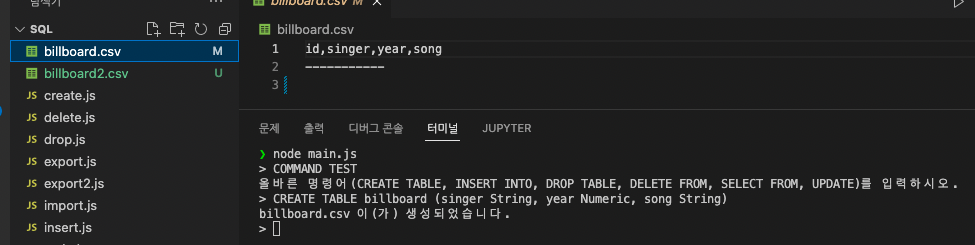
- [x] CSV 파일 생성 및 저장
- [x] INSERT INTO 구현 및 출력
  - 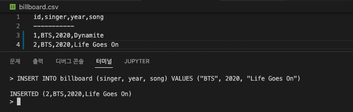
  - 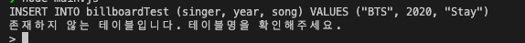
- [x] DELETE FROM 구현 및 출력
  - 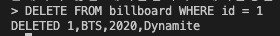
  - 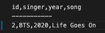
- [x] UPDATE 구현 및 출력
  - 
- [x] SELECT FROM 구현 및 출력
  - 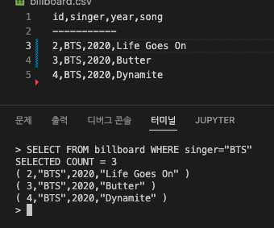
- [x] DROP TABLE 구현 및 출력

  - 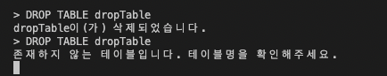

- [x] REPORT TABLE 구현 및 출력

  - 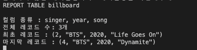

- [x] EXPORT 구현 및 출력

  - 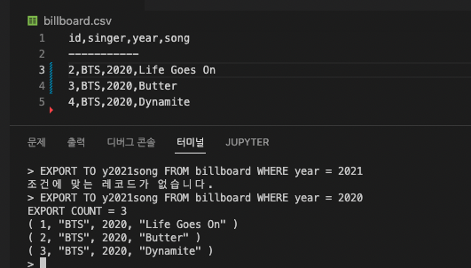
  - 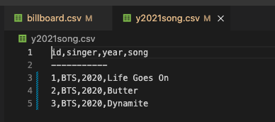

- [x] IMPORT 구현 및 출력

  - 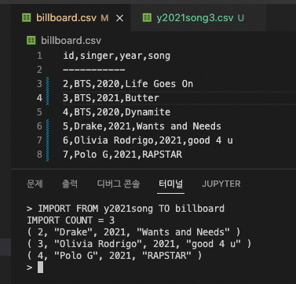
  - to 테이블의 id에 따라서 from 테이블의 id를 다시 부여했다.

- [x] 정상 동작을 구현한 구문에 대해서 실패에 대한 예외 처리 지원여부

### 아쉬운 점

중복되는 코드들이 너무 많다. 처음에 설계를 짜고 시작했어야 하는데 구현을 먼저해야겠다는 생각이 오히려 안 좋게 작용하지 않았나 싶다.

# 나만의체크포인트

- [x] cp1. create table
- [x] cp2. insert into
- [x] cp3. delete from
- [x] cp4. update
- [x] cp5. select from
- [x] cp6. drop table
- [x] cp7. report table
- [x] cp8. EXPORT
- [x] cp9. import

# 학습메모

- CSV 파일 만들기..

  https://code-boxx.com/write-csv-nodejs/

  ```javascript
  import * as fs from "fs";

  let data = "First,Second";
  data += "\r\nnew,Row";
  fs.writeFileSync("test.CSV", data);
  ```
