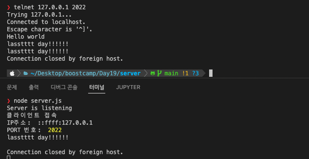

# 체크포인트

- 예외처리는 사치다🫠 오타 내면 안 됨...
- node mainServer.js / node mainClient.js
- 에코 서버는 `mainServer.js` 에서 주석 해제해서 실행하거나 사진 참조
  
- peersession 클라이언트=>서버 전송까지는 되지만! ㅜㅜ 받아둔 소켓들에 for문 돌려가면서 write을 해도 보낸 클라이언트로만 답장 옴. 검색으로 되는 예시를 찾았는데 비교하니까 코드를 다 뜯어 고쳐야할 것 같아서 gg 침ㅜ

## 에코 서버 관련

- [x] TCP 에코 서버 bind
- [x] 클라이언트 접속 후 정보 출력
- [x] 클라이언트에서 보낸 데이터 재전송

## 챌린지 서버 관련

- [x] checkin 요청 구현
  - 캠프 아이디 범위 확인 + 응답
  - 그룹 할당 후 그룹 번호 전달
- [x] checkout 요청 구현
  - 그룹 내 다른 캠퍼에게 퇴장 안내
  - TCP 연결 종료시 checkout 처리
- [x] mission 요청 구현
  - day 확인후 키워드 전송
- [ ] peersession 요청 구현
  - 그룹내 브로드캐스트 시작
- [ ] complete 요청 구현
  - 그룹내 브로드캐스트 종료
- [ ] message
  - 피어세션 진행중에 그룹내 브로드캐스트
  - 그 외에는 무시
- [ ] direct 요청 구현
  - 특정 캠퍼에게 전송

## 챌린지 클라이언트 관련

- [x] 캠프아이디 입력 후 checkin 요청 campId 전송
  - 활동 시각 저장
- [x] checkout 전송후 연결 해재
  - 체크인부터 체크아웃까지 활동 시간 출력
- [ ] peersession 요청 maxCount 전송
- [ ] complete 요청 전송
- [ ] message 요청 text 전송
- [ ] direct 요청 campId, text 전송

# 나만의 체크포인트

- [x] cp1. server class
- [x] cp2. reuse를 위한 소켓 옵션을 지정한다. => reuse는 디폴트! 그치만 왜 reuse 할까요?
- [x] cp3. client가 접속하면 최소 4자리 / 최대 1024 크기만큼 읽고, 받은 문자열을 그대로 다시 전송한다.
- [x] cp4. 새로운 client가 접속하면 어떤 IP와 Port 번호에서 접속했는지 client 정보를 콘솔 로그로 출력한다.
- [x] cp5. 서버에서 받았던 문자열을 전송 완료하고 소켓 연결을 disconnect 끊는다.
  - 
- [x] cp6. TCP 클라이언트를 별도로 구현하지 않고, 터미널에서 telnet 명령으로 접속해서 테스트한다.
- [x] cp7. 별도의 클라이언트 클래스 구축
- [x] cp8. checkin
- [x] cp9. checkout
- [x] cp10. mission
- [ ] cp11. peersession
- [ ] cp12. 여러 클라이언트 접속
- [ ] cp13. complete
- [ ] cp14. message
- [ ] cp15. direct
- [x] cp16. HTTP 포맷!

# 학습메모

- reuse: https://m.blog.naver.com/PostView.naver?isHttpsRedirect=true&blogId=bringmelove1&logNo=119146643

## http 메세지

- 요청 라인: GET
- 메세지 헤더
  JSON 형식

실시간 서비스를 만들겠다? 소켓을 이용하겠다~
소켓? UDP or TCP

net 모듈 (기본 모듈)
net.Server - 소켓 서버
net.Socket - 소켓
서버와 클라이언트는 소켓을 통해서 연결된다.

`server.listen` 클라이언트 접속 대기
connection - 클라이언트 접속 이벤트. 클라이언트와 연결된 소켓이 파라미터로 들어옴.

tcp는 연결하기 위한 소켓이 필요해요~

telnet? 사용자의 컴퓨터에서 네트워크를 이용하여 원격지에 떨어져 있는 서버에 접속하여 자료를 교환할 수 있는 프로토콜을 말한다.
데이터를 보내고 싶다! socekt -> write

채팅을 위한 서비스??

- 1:N 데이터 전달
- 채팅 관련 명령어
- 데이터 전달 + 제어 명령어 전달

https://nodejs.org/api/buffer.html#static-method-bufferbytelengthstring-encoding
https://www.w3schools.com/nodejs/met_buffer_bytelength.asp
https://stackoverflow.com/questions/35233725/buffer-bytelength-returning-drastically-different-byte-length
https://programmingsummaries.tistory.com/239
https://stackoverflow.com/questions/9763441/milliseconds-to-time-in-javascript
https://r4bb1t.tistory.com/16
